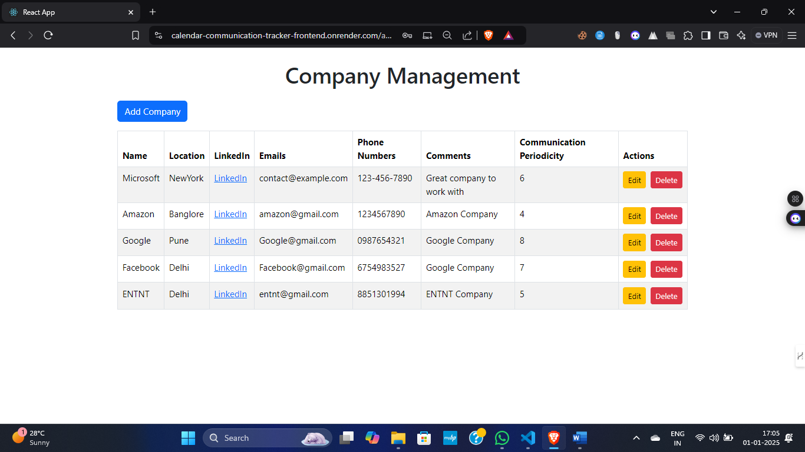
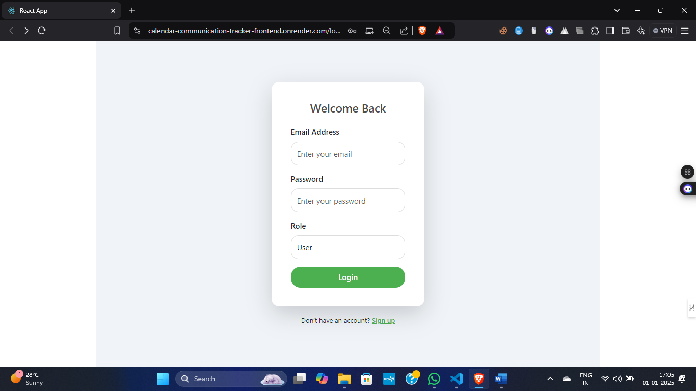
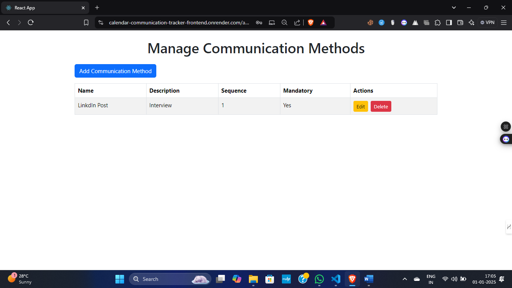
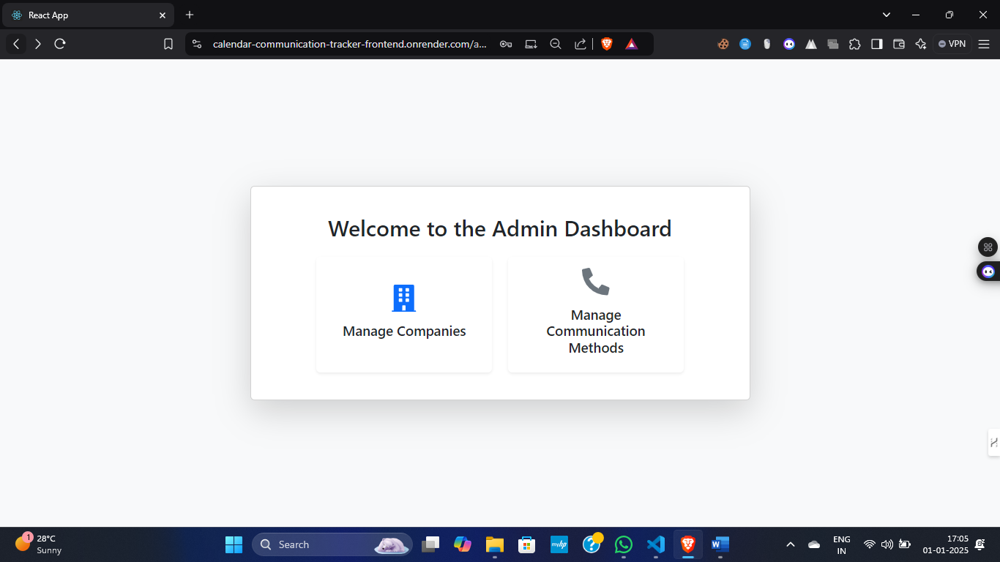
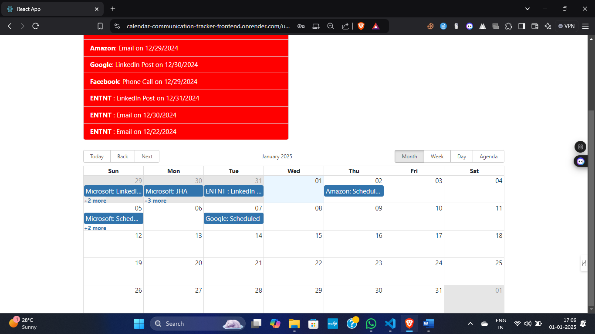

# Calendar Application for Communication Tracking

## Overview

This MERN stack-based Calendar Application is designed to efficiently manage professional communication with companies. It features modules for administrators and users, enabling seamless tracking of interactions, scheduling of tasks, and timely follow-ups. 

Deployed live on **Render**, this application emphasizes usability, clarity, and efficient data handling.

---

## Live Demo

You can check out the live demo of the project here: <a href="https://calendar-communication-tracker-frontend.onrender.com/login" target="_blank">Live Demo</a>


## Features

### Admin Module
- Manage companies with details like:
  - Name
  - Location
  - LinkedIn Profile
  - Emails and phone numbers
  - Comments
  - Communication periodicity
- Define communication methods with:
  - Name (e.g., "LinkedIn Post")
  - Description
  - Sequence
  - Mandatory flag

### User Module
- Interactive dashboard with:
  - Last five communications
  - Next scheduled communication
  - Color-coded overdue (red) and due (yellow) highlights
- Calendar view for:
  - Past communications
  - Upcoming scheduled tasks
- Log new communications with options for:
  - Type
  - Date
  - Notes


### Login
- Secure login for both Admins and Users.

---

## Screenshots








## Technologies Used

- **Frontend:** React
- **Backend:** Node.js, Express
- **Database:** MongoDB
- **Authentication:** JSON Web Tokens (JWT)
- **Deployment:** Render (Frontend and Backend)

---

## Setup and Deployment

### Prerequisites
- Node.js and npm installed
- MongoDB setup (MongoDB Atlas)

### Installation

1. Clone the repository:
   ```bash
   git clone https://github.com/Ayushjha298/calendar-communication-tracker.git
   cd calendar-communication-tracker

2. Install dependencies:
    For the backend:
   ```bash
      cd backend
      npm install
    ```
    For the frontend:
   ```bash
      cd frontend
      npm install
   ```
   
3. Set up environment variables:

    Backend: Create a .env file in the backend folder with
    ```
    MONGO_URI=<your-mongo-db-uri>
    JWT_SECRET=<your-secret-key>
    ```

4. Run the application locally:

    Start the backend:
   ```bash
    cd backend
    npm run dev
    ```
    Start the frontend:
   ```bash
    cd frontend
    npm start
    ```
Deployment

Deployed on Render:

Frontend: [Frontend URL](https://calendar-communication-tracker-frontend.onrender.com/login)
Backend: [Backend URL](https://calendar-communication-tracker-backend.onrender.com/api)

    

## Contact

For any questions or feedback, please reach out to [ayushjha298@gmail.com](mailto:ayushjha298@gmail.com).
